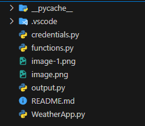
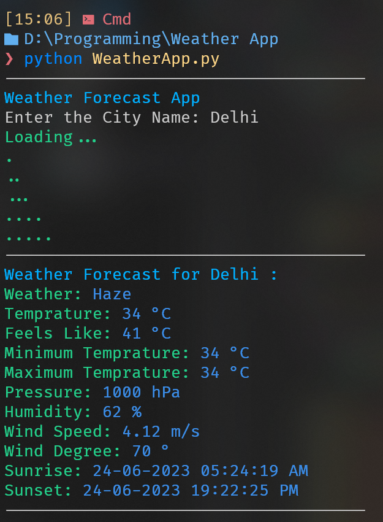
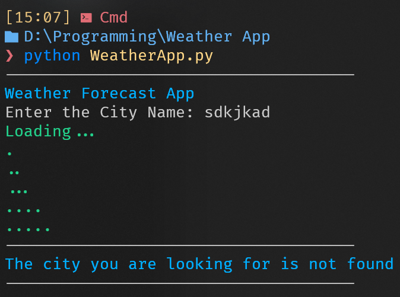

# Weather App

## Problem Statement :

**Weather Forecasting Tool - Create a command line tool that accepts a city's name and returns the current weather forecast. Leverage OpenWeatherMap API to fetch weather data and parse it using Python. Your solution should demonstrate how GitHub Copilot can help you with API usage, data parsing, and error handling.**

## Approach :

In the WeatherApp.py file has a method called getWeather which takes city name as input and returns the weather of that city. The getWeather method uses the OpenWeatherMap API to fetch the weather data of the city and then parse it using Python. The getWeather method also handles the error if the city is not found.

## Used Co-Pilot Suggestions :

1. Used the requests module to make a GET request to the OpenWeatherMap API.
2. Used the json module to parse the response from the API.
3. Used the rich module to print the colorful output.
4. Used the to convert Kelvin to Celcius.
5. Used the datetime module to convert sunrise and sunset time to local time.

## File Structure :

## Case 1 (When city is found):

## Case 2 (When city is not found):

## Video Recording of the Project :

